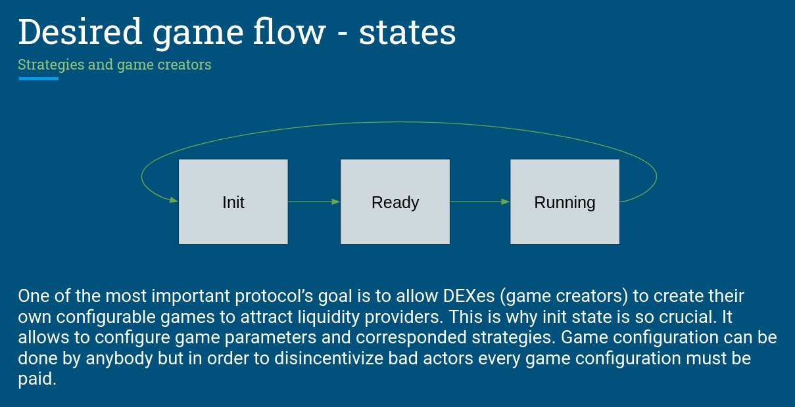

# Challenge
Liquidity on DEXes is a crucial factor which is responsible for costs of swap (slippages) and liquidity providing efficiency (impernament loss). Low liquidity results in volatility in cryptocurrency prices and exposes the exchanges to market manipulation. Despite the clear benefits of yield farming, DEXes may still struggle to attract liquidity providers to their exchanges. Commonly, DEXes compete for liquidity by offering high annual percentage rates with highly inflationary tokens. However, this obscures the effective APR of staking tokens. Current incentive system seems to be not working well and there is visible need for mechanisms which attract liquidity providers. 

# Solution
Bringing liquidity to the DEXes can must be incetivised properly to win compete with others. What is better way to do so than by bringing the concept of play and earn to the DEX market. It is a highly-attractive commercial tool for bringing new liquidity providers to the scene. Games can make tokens staking more enticing to users. It would also attract recurrent staking by users due to its addictive nature. **DeFi Conquest** is a decentralized game that addresses the lack of liquidity in DeFi. The game offers DEXes the ability to easily scaffold a no-loss, play and earn, decentralized strategy game which runs autonomously. Players deploy their liquidity to play in the game. At the end of the game each player can redeem the same amount of liquidity tokens (LP). 

# Why it Matters
**DeFi Conquest** introduces a novel and effective approach to incentivizing liquidity provision in decentralized exchanges. By combining gaming elements with DeFi, the project addresses existing challenges in the space and offers to DExes easy autonomous no-loss game with a compelling feelings that can attract and retain liquidity providers in a competitive market.

The target audiences of this project are not only players but DEXes which will want to increase liquidity by implementing our game. Using our protocol, DEXes will be able to configure which Liquidity Provider (LP) tokens are required for users to deposit in order to join their game, as well as several other configurations such as: game duration, deposit amount, player attributes and determine which LP tokens will be assigned to each nation (orcs, elves, human, dwarfs). Mainly DEXes will be able to determine its own strategies for LP tokens:

