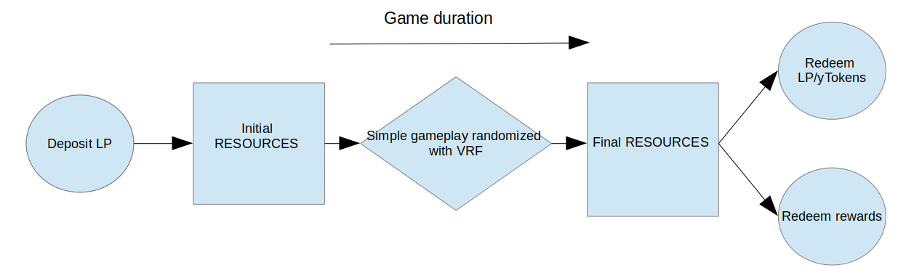
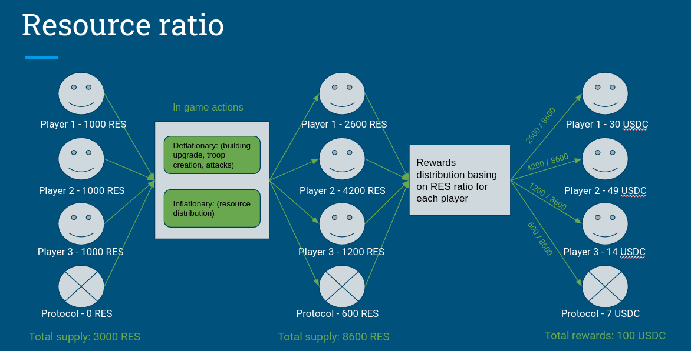

# Challenge
Liquidity on DEXes is a crucial factor which is responsible for costs of swap (slippages) and liquidity providing efficiency (impernament loss). Low liquidity results in volatility in cryptocurrency prices and exposes the exchanges to market manipulation. Despite the clear benefits of yield farming, DEXes may still struggle to attract liquidity providers to their exchanges. Commonly, DEXes compete for liquidity by offering high annual percentage rates with highly inflationary tokens. However, this obscures the effective APR of staking tokens. Current incentive system seems to be not working well and there is visible need for mechanisms which attract liquidity providers. 

# Solution
Bringing liquidity to the DEXes must be incetivised properly to win compete with others. What is better way to do so than by bringing the concept of play and earn to the DEX market. Games can make tokens staking more enticing to users. It would also attract recurrent staking by users due to its addictive nature. The project called **DeFi Conquest** will be a decentralized game that addresses the lack of liquidity in DeFi. The game will offer DEXes the ability to easily scaffold a no-loss, play and earn, decentralized strategy game which runs autonomously. Players deploy their liquidity to play in the game. At the end of the game each player can redeem the same amount of liquidity tokens or yield bearing tokens. 

# Why it Matters
**DeFi Conquest** introduces a novel and effective approach to incentivizing liquidity provision in decentralized exchanges. By combining gaming elements with DeFi, the project addresses existing challenges in the space and offers to DExes easy autonomous no-loss game with a compelling feelings that can attract and retain liquidity providers in a competitive market.
The target audiences of this project are not only players but DEXes which will want to increase liquidity by implementing the game. DEXes will be able to configure which tokens are required for users to deposit in order to join their game, as well as several other configurations such as: game duration, deposit amount, player attributes.

# Game specific
- Game will be autonomous automation and randomized.
  

- Game will guarantee that each user will have the same amount of deposited tokens and the subject of competition will be the rewards tokens:
  
 

# Main milestones
## Front-end
- Moon authentication 
- Deposit to yearn using moon [API](https://docs.usemoon.ai/api#tag/yearn/operation/AddLiquidity) or Uniswap [API](https://docs.usemoon.ai/api#tag/UniSwap/operation/AddLiquidity)
- Game deposit and obtaining balance of yToken 

## Smart Contract
- Accepts yToken as ticket to the game
- Provides autonomous game flow via chainlink automation 
- Game logic - depends on time can be simple game based on chainlink VRF. *Nice to have some simple battle system (can propose a few)
- In-game resources which will be the base for rewards distribution
- Rewards distribution at the end of the game. The same amount of tokens deposited by the user will be returned. The rewards from yTokens will be deposited based on game performance.
- *Protocol earnings
- *Configurations for dexes

